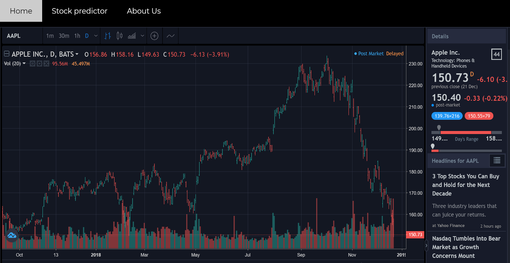
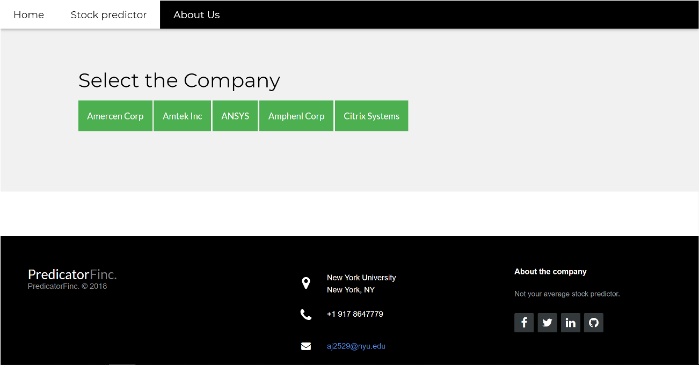
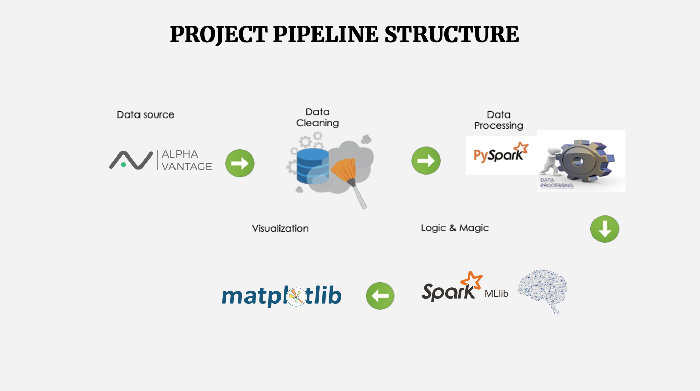

# PredictorFinc.
PredictorFinc is a scalable supervised machine learning model the predicts stock price change through Decision Tree Regressor using data
collected every hour for 20 year for 500 companies obtained via Alpha Vantage API

## Motivation
In the world of finance, stock trading is one of the most important activities. Professional traders have developed a variety of analysis methods such as fundamental analysis, technical analysis, quantitative analysis, and so on. Such analytically methods make use of different sources ranging from news to price data, but they all aim at predicting the company’s future stock prices so they can make educated decisions on their trading.

In recent years, the increasing prominence of machine learning in various industries have enlightened many traders to apply machine learning techniques to the field, and some of them have produced quite promising results.

Trading stocks on the stock market is one of the major investment activities. In the past, investors developed a number of stock analysis method that could help them predict the direction of stock price movement. Modelling and predicting of equity future price, based on the current financial information and news, is of enormous use to the investors. Investors want to know whether some stock will rise or fall over certain period of time. In order to predict how some company, in which investor want to invest, would perform in future, they developed a number of analysis methods based on current and past financial data and other information about the company. Financial balance sheets and various ratios that describe the health of company are the bases of technical analysis that investors undertake to analyse and predict company’s future stock prize. Predicting the change of stock price is particularly important for value investing.

Big data means a lot in financial services in the transformation of the organization services, profits, etc. It is more promising for financial analysts and also the investors for their services and investments. The large information gathered over stock message boards is being large assets for nearly 71 percent of organizations and it also uses the historical time series data for accurate predictions of the stock market. It also gains new insights of financial organizations as well as investors. Big data technologies create a value for these types of data in financial market. This project deals with the models that can be used with predictive analytics of big data in financial market for better predictions.

## Steps
1. Identified the AlphaVantage API for Data Collection
2. Cleaned the data to get the required features by using data frames
3. Using Decision Tree Classifier to predict the stock prices change
4. Made the model more scalable using PySpark
5. Visualized the data with respected to the trained data

## Background Related Work
Wilson and Sharda studied prediction firm bankruptcy using neural networks and classical multiple discriminant analysis, where neural networks performed significantly better than multiple discriminant analysis (Wilson & Sharda, 1994). Min and Lee were doing prediction of bankruptcy using machine learning. They evaluated methods based on SVM, multiple discriminant analysis, logistic regression analysis, and three-layer fully connected back-propagation neural networks. The results indicated that’s upport vector machines outperformed outer approaches (Min & Lee, 2005). Similarly, Tam was predicting bank bankruptcy using neural networks (Tam, 1991).

Lee was trying to predict credit rating of a company using support vector machines. They used various financial indicator and ratios such as interest coverage ratio, ordinary income to total assets, Net income to stakeholders’ equity, current liabilities ratio, etc. and achieved accuracy of around 60% (Lee, 2007). Predicting credit rating of the companies were also studied using neural networks achieving accuracy between 75% and 80% for US and Taiwan markets (Huang, et al., 2004).

Phua et al. performed a study predicting movement of major five stock indexes: DAX, DJIA, FTSE-100, HSI and NASDAQ. They used neural networks and they were able to predict the sign of price movement with accuracy higher than 60% by using component stocks as input for the prediction (Phua, et al., 2003).

Our preliminary model suggests that naively passing in time series data of stock price works no better than random guessing, so we applied complicated scalable models to pre-process the time series data before running ML models. We didn’t find any works that combined these financial technical indicators with machine learning algorithms using Big data analytics like we did. And we got better results than other papers we found in this particular problem domain.

## Architecture
The complete data analysis was done on NYU High-Performance Clustering. The architecture is as follows:

## Dataset
We use Alpha Vantage API to access the time series data of S&P 500 stocks of past 20 years. The
API provides access to intraday time series, daily time series, weekly time series and monthly time
series data. Since the domain of our problem is change in stock prediction, we decided to proceed
with daily time series data, which includes daily open price, daily high price, daily low price, and
daily close price.

### Data Pre-processing and Cleaning
    The data we streamed using Alpha Vantage API were messy and the column names were not
    consistent among different files for the same dataset.
    Moreover, we had to deal with nulls, nan and missing values. All of them were represented
    differently, for e.g., nulls were represented as “nan”, “*”, “/”. The pre-processing included:
     Aggregating all the year data for the past 20 year into a single file.
    • Provided a single schema while merging the files.
    • Imputed and removed nans, nulls and empty values according to the use case.
    • Removed the metric sign, for e.g., $ and % sign from the column values so as to perform
    calculations on them.
    • We used spark to analyse the stock values of 500 companies and took data from alpha vantage
    API.
    • In order to predict-stock we decided to explore the high value, low value, opening value and
    closing value of stock dataset of 20 years
    • Finally, we can predict the stock prices for the given company.
    
## Machine Learning – MLib
ML was an integral part of this project as conventional methods fail to predict and have their own limitations.
We used DecisionTreeRegression as out choice of model because it gives a comparatively low RMSE and a high score when compared to most other models. We extensively used MLlib in our project because it fit into Spark's APIs and interoperates with NumPy in Python.

Outline of steps followed:

1. Data procurement
2. Feature Selection
3. Data cleaning and processing (fitting missing values and converting categorical values to numerical using OneHotEncoderEstimator)
4. Training and k-Cross validation
5. Testing
6. Hyperparameters tuning for optimising prediction

## Visualization

## Future Scope
* Based on available data, predict which stock is going to perform the best in the next and will give maximum returns.
* Taking into account the twitter sentiments to determine the change in prices.
* Provide suggestions for buying a particular buyer or stock broker, which could help them predict prices more accurately.